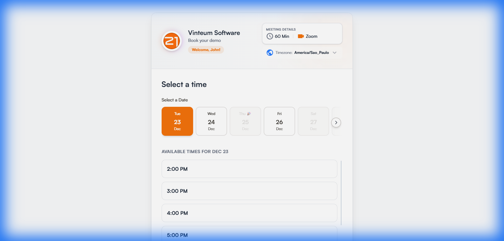
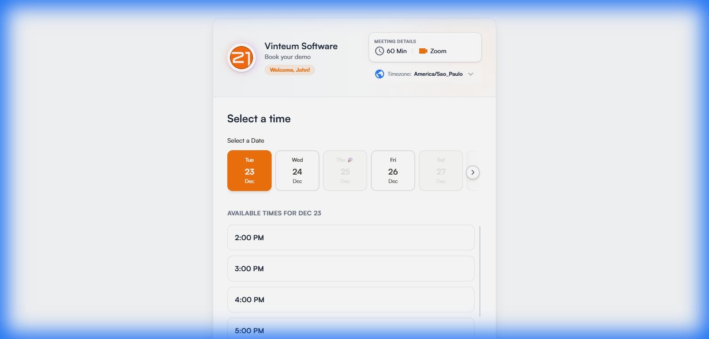
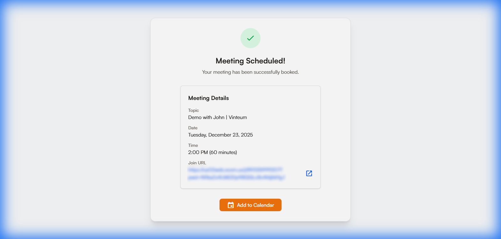
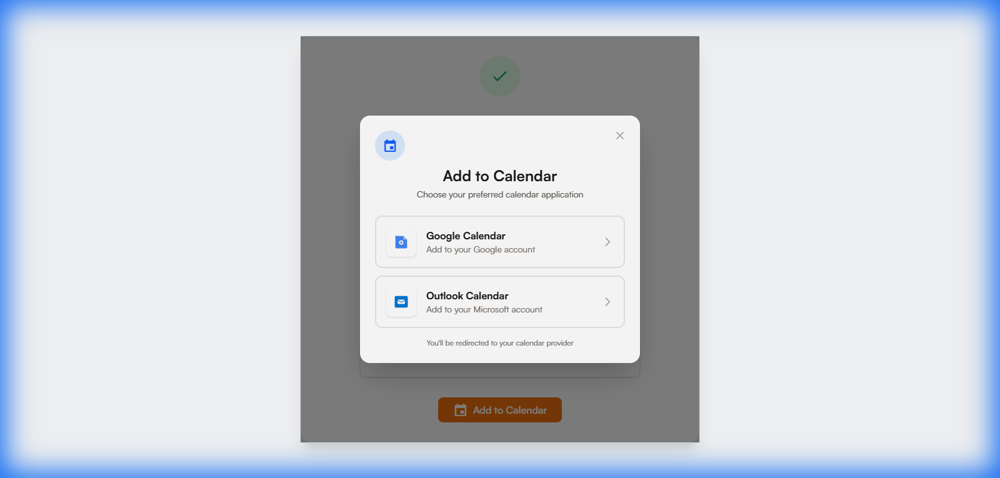

# 🎯 Vinteum Calendar - Smart Booking Widget

<div align="center">

**An intelligent booking widget that automates meeting scheduling with seamless HubSpot CRM and Zoom integration**

Built for sales teams who need to manage meeting capacity and automate their booking workflow. This widget ensures no time slot gets overbooked while automatically creating contacts, deals, and Zoom meetings.

[](https://www.typescriptlang.org/)
[](https://reactjs.org/)
[](https://nodejs.org/)
[](https://tailwindcss.com/)

[Features](#-features) • [Quick Start](#-quick-start) • [API](#-api-endpoints) • [Deployment](#-deployment)

</div>

---

## 📸 Screenshots

### Main Booking Interface

*Modern interface with Vinteum branding, date selector, and hourly time slots*

### Interactive Hover States

*Smooth hover animations on date cards*

### Booking Confirmation

*Success screen with meeting details and calendar export option*

### Calendar Export Modal

*One-click export to Google Calendar or Outlook*

---

## ✨ Features

- 🎨 **Beautiful Animated UI** - Modern design with Satoshi font and Vinteum branding
- � **Smart Availability** - Checks Zoom calendar for conflicts and blocks booked slots
- 🔄 **Atomic Transactions** - All-or-nothing booking with automatic rollback on failure
- 🎯 **Real-time Sync** - Integrates with HubSpot CRM and Zoom API
- 📱 **Fully Responsive** - Works perfectly on desktop, tablet, and mobile
- �️ **Calendar Export** - Add meetings to Google Calendar or Outlook with one click
- ⚡ **Lightning Fast** - Built with Vite for optimal performance
- 🎭 **Mock Mode** - Test without real API credentials

---

##  Quick Start

### Prerequisites

- Node.js v18+ and npm v9+
- HubSpot account with Private App access
- Zoom account with Server-to-Server OAuth credentials

### Installation

1. **Clone the repository**
   ```bash
   git clone https://github.com/fabricio-vinteum/Vinteum---Calendar-Booking.git
   cd vinteumcalendar
   ```

2. **Install dependencies**
   ```bash
   # Backend
   cd server
   npm install

   # Frontend
   cd ../client
   npm install
   ```

3. **Configure environment variables**

   **Backend** - Copy `server/.env.example` to `server/.env` and fill in your credentials:
   ```bash
   cd server
   cp .env.example .env
   ```

   **Frontend** - Copy `client/.env.example` to `client/.env`:
   ```bash
   cd client
   cp .env.example .env
   ```

4. **Start development servers**
   ```bash
   # Terminal 1: Backend
   cd server
   npm run dev

   # Terminal 2: Frontend
   cd client
   npm run dev
   ```

5. **Open your browser**
   ```
   http://localhost:5173/?name=John&email=john@example.com
   ```

---

## 🏗️ Architecture

```
vinteumcalendar/
├── client/                 # React Frontend
│   ├── public/
│   │   ├── font/          # Satoshi font files
│   │   └── img/           # Vinteum logo
│   ├── src/
│   │   ├── components/    # React components
│   │   ├── api/          # API clients
│   │   ├── hooks/        # Custom React hooks
│   │   ├── utils/        # Utility functions
│   │   └── types/        # TypeScript types
│   └── .env.example
│
├── server/                # Express Backend
│   ├── src/
│   │   ├── adapters/     # External API integrations
│   │   │   ├── hubspotAdapter_v3.ts
│   │   │   └── zoomAdapter.ts
│   │   ├── routes/       # API routes
│   │   │   ├── availability.ts
│   │   │   └── bookings.ts
│   │   ├── services/     # Business logic
│   │   │   └── bookingService.ts
│   │   ├── errors/       # Custom error classes
│   │   ├── config/       # Configuration
│   │   └── server.ts     # Entry point
│   └── .env.example
│
└── README.md
```

---

## 🔌 API Endpoints

### GET `/api/availability`
Get available time slots for a specific date.

**Query Parameters:**
- `date`: Date in YYYY-MM-DD format
- `timezone`: IANA timezone (e.g., "America/Sao_Paulo")

**Response:**
```json
{
  "slots": [
    "2025-12-23T12:00:00-05:00",
    "2025-12-23T13:00:00-05:00",
    "2025-12-23T14:00:00-05:00"
  ]
}
```

### POST `/api/bookings`
Create a new booking.

**Request Body:**
```json
{
  "email": "john@example.com",
  "firstname": "John",
  "date": "2025-12-23T12:00:00-05:00",
  "timezone": "America/Sao_Paulo",
  "topic": "Demo Meeting",
  "duration": 60
}
```

**Response:**
```json
{
  "success": true,
  "contactId": "12345",
  "dealId": "67890",
  "meetingId": "abc123",
  "joinUrl": "https://zoom.us/j/123456789",
  "topic": "Demo with Company Name | Vinteum"
}
```

---

## 🎨 Tech Stack

### Frontend
- **React 19** - UI library
- **TypeScript** - Type safety
- **Vite** - Build tool
- **Tailwind CSS v4** - Styling
- **Satoshi Font** - Custom typography
- **Material Icons** - Icon library

### Backend
- **Node.js** - Runtime
- **Express** - Web framework
- **TypeScript** - Type safety
- **HubSpot API** - CRM integration
- **Zoom API** - Video conferencing
- **Zod** - Schema validation

---

## 🔐 HubSpot & Zoom Setup

### HubSpot Configuration

1. **Create a Private App:**
   - Go to Settings → Integrations → Private Apps
   - Click "Create a private app"
   - Name it "Booking Widget"

2. **Set Required Scopes:**
   - `crm.objects.contacts.read`
   - `crm.objects.contacts.write`
   - `crm.objects.deals.read`
   - `crm.objects.deals.write`

3. **Copy Access Token** to `HUBSPOT_ACCESS_TOKEN` in `.env`

### Zoom Configuration

1. **Create Server-to-Server OAuth App:**
   - Visit [Zoom App Marketplace](https://marketplace.zoom.us/)
   - Create new Server-to-Server OAuth app
   - Copy Account ID, Client ID, and Client Secret

2. **Set Required Scopes:**
   - `meeting:write`
   - `meeting:read`
   - `user:read`

3. **Add Credentials** to `.env` file

---

## 🌐 Deployment

### Environment Variables (Production)

**Backend:**
```env
HUBSPOT_ACCESS_TOKEN=xxx-xxx-xxxxx
HUBSPOT_MOCK_MODE=false
ZOOM_ACCOUNT_ID=xxxxx
ZOOM_CLIENT_ID=xxxxx
ZOOM_CLIENT_SECRET=xxxxx
ZOOM_MOCK_MODE=false
PORT=3000
NODE_ENV=production
```

**Frontend:**
```env
VITE_API_URL=https://api.yourdomain.com
VITE_ENV=production
```

### Deployment Options

- **Vercel** (Frontend) + **Railway** (Backend) - Recommended for quick deployment
- **cPanel** - See [CPANEL-DEPLOYMENT.md](./CPANEL-DEPLOYMENT.md)
- **VPS/Cloud** - See [DEPLOYMENT.md](./DEPLOYMENT.md)

---

## 🔗 Embedding the Widget

Add this iframe to your website:

```html
<iframe 
  src="https://your-widget-domain.com/?name=John%20Doe&email=john@example.com"
  width="100%"
  height="800px"
  frameborder="0"
  style="border-radius: 12px; box-shadow: 0 4px 6px rgba(0,0,0,0.1);"
></iframe>
```

### URL Parameters
- `name` (required): Contact's first name
- `email` (required): Contact's email address

---

## � Key Features

### Zoom Calendar Integration
- Automatically checks Zoom for existing meetings
- Blocks time slots that conflict with scheduled meetings
- Prevents double-booking across your team

### Calendar Export
- One-click export to Google Calendar
- One-click export to Outlook Calendar
- Pre-filled event details with Zoom link

### Atomic Transactions
The booking process follows a 5-step atomic transaction:
1. Find or create HubSpot contact (with company lookup)
2. Create Zoom meeting with dynamic topic
3. Create HubSpot deal
4. Associate deal with contact
5. Return meeting details to user

If any step fails, the entire transaction rolls back automatically.

### Mock Mode
Perfect for development and testing:
- Simulates HubSpot and Zoom API responses
- No real API calls or credentials needed
- Configurable via `HUBSPOT_MOCK_MODE` and `ZOOM_MOCK_MODE`

---

## 🎨 Customization

### Branding
- Logo: Replace `client/public/img/logo.png`
- Colors: Update `--color-primary` in `client/src/index.css`
- Font: Replace Satoshi fonts in `client/public/font/`

### Meeting Settings
- Duration: Update in `client/src/components/BookingWidget.tsx` and `HostProfile.tsx`
- Time slots: Modify `server/src/adapters/zoomAdapter.ts` (currently 7am-6pm GMT-5)
- Timezone: System uses GMT-5, displays in user's local timezone

---

## 📝 License

MIT License - feel free to use this project for personal or commercial purposes.

---

## 🤝 Contributing

Contributions are welcome! Please feel free to submit a Pull Request.

1. Fork the repository
2. Create your feature branch (`git checkout -b feature/AmazingFeature`)
3. Commit your changes (`git commit -m 'Add some AmazingFeature'`)
4. Push to the branch (`git push origin feature/AmazingFeature`)
5. Open a Pull Request

---

<div align="center">

**Made by Fabrício Nogueira**  
*International Marketing Specialist*  
**Vinteum - 2025**

---

**Built with ❤️ for Vinteum Software**

⭐ Star this repo if you find it helpful!

</div>
