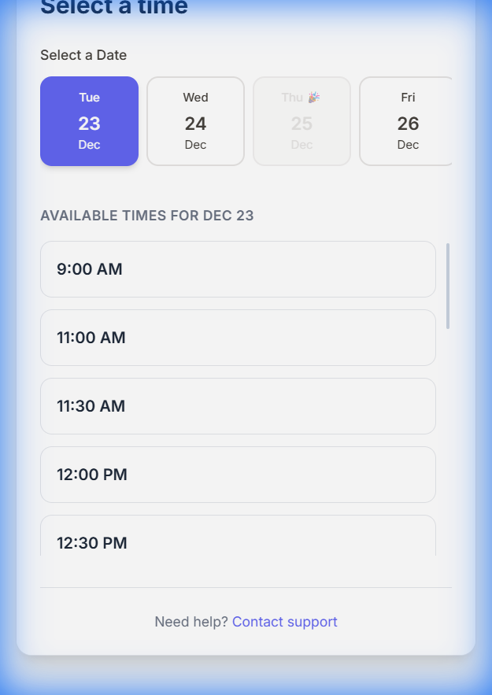

# 🎯 Booking Widget - HubSpot & Zoom Integration

<div align="center">


**A modern, animated booking widget that seamlessly integrates with HubSpot CRM and Zoom**

[](https://www.typescriptlang.org/)
[](https://reactjs.org/)
[](https://nodejs.org/)
[](https://tailwindcss.com/)

[Features](#-features) • [Demo](#-demo) • [Quick Start](#-quick-start) • [Documentation](#-documentation) • [Deployment](#-deployment)

</div>

---

## ✨ Features

- 🎨 **Beautiful Animated UI** - Material Design with smooth fade-in, slide-up, and hover animations
- 📅 **Smart Capacity Management** - Limits each time slot to 2 bookings (configurable)
- 🔄 **Atomic Transactions** - All-or-nothing booking with automatic rollback on failure
- 🎯 **Real-time Availability** - Dynamic slot filtering based on existing bookings
- 📱 **Fully Responsive** - Works perfectly on desktop, tablet, and mobile
- 🔗 **Easy Integration** - Embed anywhere with a simple iframe
- ⚡ **Lightning Fast** - Built with Vite for optimal performance
- 🎭 **Mock Mode** - Test without real API credentials

---

## 🖼️ Screenshots

### Main Interface


### Interactive Hover States


### Available Time Slots


---

## 🚀 Quick Start

### Prerequisites

- Node.js v18+ and npm v9+
- HubSpot account with Private App access
- Zoom account with OAuth credentials

### Installation

1. **Clone the repository**
   ```bash
   git clone https://github.com/Pizlo/vinteumcalendar.git
   cd vinteumcalendar
   ```

2. **Install dependencies**
   ```bash
   # Backend
   cd server
   npm install

   # Frontend
   cd ../client
   npm install
   ```

3. **Configure environment variables**

   **Backend** (`server/.env`):
   ```env
   HUBSPOT_ACCESS_TOKEN=your_hubspot_token
   HUBSPOT_MOCK_MODE=true

   ZOOM_ACCOUNT_ID=your_zoom_account_id
   ZOOM_CLIENT_ID=your_zoom_client_id
   ZOOM_CLIENT_SECRET=your_zoom_client_secret
   ZOOM_MOCK_MODE=true

   PORT=3000
   NODE_ENV=development
   ```

   **Frontend** (`client/.env`):
   ```env
   VITE_API_URL=http://localhost:3000
   VITE_ENV=development
   ```

4. **Start development servers**
   ```bash
   # Terminal 1: Backend
   cd server
   npm run dev

   # Terminal 2: Frontend
   cd client
   npm run dev
   ```

5. **Open your browser**
   ```
   http://localhost:5173/?name=John&email=john@example.com
   ```

---

## 🏗️ Architecture

```
booking-widget/
├── client/                 # React Frontend
│   ├── src/
│   │   ├── components/    # React components
│   │   │   ├── BookingWidget.tsx
│   │   │   ├── HostProfile.tsx
│   │   │   ├── CalendarContainer.tsx
│   │   │   ├── DateStripSelector.tsx
│   │   │   ├── TimeSlotGrid.tsx
│   │   │   └── BookingConfirmation.tsx
│   │   ├── api/          # API clients
│   │   ├── hooks/        # Custom React hooks
│   │   ├── utils/        # Utility functions
│   │   └── types/        # TypeScript types
│   └── index.html
│
├── server/                # Express Backend
│   ├── src/
│   │   ├── adapters/     # External API integrations
│   │   │   ├── hubspotAdapter.ts
│   │   │   └── zoomAdapter.ts
│   │   ├── routes/       # API routes
│   │   │   ├── availability.ts
│   │   │   └── bookings.ts
│   │   ├── services/     # Business logic
│   │   │   └── bookingService.ts
│   │   ├── errors/       # Custom error classes
│   │   ├── config/       # Configuration
│   │   └── server.ts     # Entry point
│   └── package.json
│
└── README.md
```

---

## 🔌 API Endpoints

### GET `/api/availability`
Get available time slots for a specific date.

**Query Parameters:**
- `date`: Date in YYYY-MM-DD format
- `timezone`: IANA timezone (e.g., "America/Sao_Paulo")

**Response:**
```json
{
  "slots": [
    "2025-12-23T09:00:00.000Z",
    "2025-12-23T10:00:00.000Z",
    "2025-12-23T11:00:00.000Z"
  ]
}
```

### POST `/api/bookings`
Create a new booking.

**Request Body:**
```json
{
  "email": "john@example.com",
  "firstname": "John",
  "date": "2025-12-23T09:00:00.000Z",
  "timezone": "America/Sao_Paulo",
  "topic": "Sales Meeting",
  "duration": 30
}
```

**Response:**
```json
{
  "success": true,
  "contactId": "12345",
  "dealId": "67890",
  "meetingId": "abc123",
  "joinUrl": "https://zoom.us/j/123456789"
}
```

---

## 🎨 Tech Stack

### Frontend
- **React 18** - UI library
- **TypeScript** - Type safety
- **Vite** - Build tool
- **Tailwind CSS v4** - Styling
- **Material Icons** - Icon library
- **Axios** - HTTP client
- **Zod** - Runtime validation

### Backend
- **Node.js** - Runtime
- **Express** - Web framework
- **TypeScript** - Type safety
- **HubSpot API** - CRM integration
- **Zoom API** - Video conferencing
- **Zod** - Schema validation

---

## 🌐 Deployment

### Quick Deploy Options

#### Option 1: Vercel (Frontend) + Railway (Backend)
- **Frontend:** Deploy to Vercel with one click
- **Backend:** Deploy to Railway with automatic builds
- **Best for:** Quick deployment with minimal configuration

#### Option 2: cPanel Hosting
- **Complete guide:** See [CPANEL-DEPLOYMENT.md](./CPANEL-DEPLOYMENT.md)
- **Best for:** Shared hosting environments

#### Option 3: VPS/Cloud Server
- **Complete guide:** See [DEPLOYMENT.md](./DEPLOYMENT.md)
- **Best for:** Full control and customization

### Environment Variables (Production)

**Backend:**
```env
HUBSPOT_ACCESS_TOKEN=pat-na1-xxxxx
HUBSPOT_MOCK_MODE=false
ZOOM_ACCOUNT_ID=xxxxx
ZOOM_CLIENT_ID=xxxxx
ZOOM_CLIENT_SECRET=xxxxx
ZOOM_MOCK_MODE=false
PORT=3000
NODE_ENV=production
ALLOWED_ORIGINS=https://yourdomain.com
```

**Frontend:**
```env
VITE_API_URL=https://api.yourdomain.com
VITE_ENV=production
```

---

## 🔗 Embedding the Widget

Add this iframe to your website:

```html
<iframe 
  src="https://your-widget-domain.com/?name=John%20Doe&email=john@example.com"
  width="100%"
  height="800px"
  frameborder="0"
  style="border-radius: 12px; box-shadow: 0 4px 6px rgba(0,0,0,0.1);"
></iframe>
```

### URL Parameters
- `name` (required): Contact's first name
- `email` (required): Contact's email address

---

## 🔐 HubSpot & Zoom Setup

### HubSpot Configuration

1. **Create a Private App:**
   - Go to Settings → Integrations → Private Apps
   - Click "Create a private app"
   - Name it "Booking Widget"

2. **Set Required Scopes:**
   - `crm.objects.contacts.read`
   - `crm.objects.contacts.write`
   - `crm.objects.deals.read`
   - `crm.objects.deals.write`

3. **Copy Access Token** to `HUBSPOT_ACCESS_TOKEN`

### Zoom Configuration

1. **Create Server-to-Server OAuth App:**
   - Visit Zoom App Marketplace
   - Create new Server-to-Server OAuth app
   - Copy Account ID, Client ID, and Client Secret

2. **Set Required Scopes:**
   - `meeting:write`
   - `user:read`

3. **Add Credentials** to environment variables

---

## 🐛 Troubleshooting

### "Unable to Load Times" Error
**Cause:** Backend server not running or CORS issue

**Solution:**
```bash
# Check backend health
curl http://localhost:3000/api/health

# Verify CORS settings
ALLOWED_ORIGINS=http://localhost:5173
```

### Build Errors
**Solution:**
```bash
# Clean install
rm -rf node_modules package-lock.json
npm install

# Check TypeScript
npx tsc --noEmit
```

---

## 📊 Features in Detail

### Capacity Management
- Each time slot can accommodate **2 bookings** (configurable)
- Automatically filters out fully booked slots
- Real-time availability checking via HubSpot deals

### Atomic Transactions
The booking process follows a 5-step atomic transaction:
1. Find or create HubSpot contact
2. Create Zoom meeting
3. Create HubSpot deal
4. Associate deal with contact
5. Log meeting to timeline

If any step fails, the entire transaction rolls back automatically.

### Mock Mode
Perfect for development and testing:
- Simulates HubSpot and Zoom API responses
- No real API calls or credentials needed
- Configurable via `HUBSPOT_MOCK_MODE` and `ZOOM_MOCK_MODE`

---

## 📝 License

MIT License - feel free to use this project for personal or commercial purposes.

---

## 🤝 Contributing

Contributions are welcome! Please feel free to submit a Pull Request.

1. Fork the repository
2. Create your feature branch (`git checkout -b feature/AmazingFeature`)
3. Commit your changes (`git commit -m 'Add some AmazingFeature'`)
4. Push to the branch (`git push origin feature/AmazingFeature`)
5. Open a Pull Request

---

## 📞 Support

For issues or questions:
- Open an issue on GitHub
- Check the [Deployment Guide](./DEPLOYMENT.md)
- Review the [cPanel Guide](./CPANEL-DEPLOYMENT.md)

---

<div align="center">

**Built with ❤️ using React, TypeScript, and modern web technologies**

⭐ Star this repo if you find it helpful!

</div>
